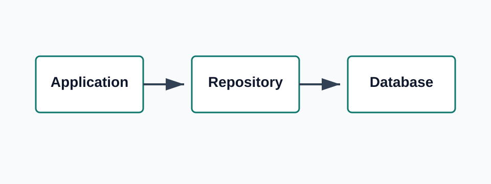

import Callout from '../../../components/mdx/Callout.astro';
import Mermaid from '../../../components/mdx/Mermaid.astro';

Generic repository pattern huu ich khi no bao ve application code khoi cac chi tiet persistence lap lai. No tro nen co hai khi che giau hanh vi truy van quan trong hoac lap lai nhung viec Entity Framework da lam tot.



## Hinh Dang Cua Pattern

Mot repository interface nho thuong chi bat dau voi cac thao tac ma hau het aggregate that su dung chung.

```csharp
public interface IRepository<TAggregate>
    where TAggregate : class
{
    Task<TAggregate?> GetByIdAsync(Guid id, CancellationToken cancellationToken);
    Task AddAsync(TAggregate aggregate, CancellationToken cancellationToken);
    void Remove(TAggregate aggregate);
}
```

<Callout type="warning">
Dung them moi kieu query method chi vi mot aggregate nao do co the can ve sau.
</Callout>

## Trien Khai

Phan implementation nen mong. Entity Framework van chiu trach nhiem change tracking va sinh SQL.

```csharp
public sealed class EfRepository<TAggregate> : IRepository<TAggregate>
    where TAggregate : class
{
    private readonly AppDbContext dbContext;

    public EfRepository(AppDbContext dbContext)
    {
        this.dbContext = dbContext;
    }

    public Task<TAggregate?> GetByIdAsync(Guid id, CancellationToken cancellationToken)
    {
        return dbContext.Set<TAggregate>().FindAsync([id], cancellationToken).AsTask();
    }

    public Task AddAsync(TAggregate aggregate, CancellationToken cancellationToken)
    {
        return dbContext.Set<TAggregate>().AddAsync(aggregate, cancellationToken).AsTask();
    }

    public void Remove(TAggregate aggregate)
    {
        dbContext.Set<TAggregate>().Remove(aggregate);
    }
}
```

## Ranh Gioi Query

Generic repository khong nen ep cac truy van giau ngu nghia di qua nhung generic method kho doc. Voi cac truong hop doc du lieu nhieu, hay uu tien query ro rang.

```sql
select
    o.Id,
    o.OrderNumber,
    o.CreatedAt,
    sum(i.Quantity * i.UnitPrice) as Total
from Orders o
join OrderItems i on i.OrderId = o.Id
where o.CustomerId = @CustomerId
group by o.Id, o.OrderNumber, o.CreatedAt
order by o.CreatedAt desc;
```

## Request Flow

<Mermaid chart={`flowchart LR
    Controller --> Handler
    Handler --> Repository
    Repository --> DbContext
    DbContext --> SQL[(SQL Database)]`} />

## Quy Tac Thuc Te

Dung generic repository cho viec load va persist aggregate mot cach nhat quan. Dung query object, specification, hoac read model truc tiep khi cau hoi mang tinh domain-specific.

<Callout type="tip">
Neu abstraction lam mot query don gian kho doc hon, abstraction do co le qua rong.
</Callout>
